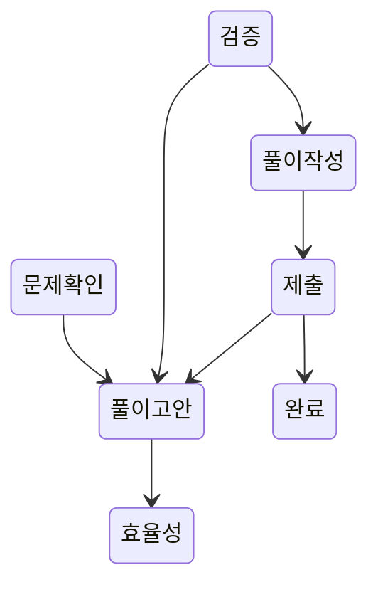

# CHAPTER2. 시간복잡도

---
### 시간복잡도
- 코드 혹은 알고리즘의 실행 시간과 데이터의 상관관계를 시간 복잡도라고 한다.
- 코드의 실행 시간이 어떤 요인으로 결정되는지 나타내는 시간과 입력 데이터의 함수 관계

### 빅오표기법
- 알고리즘이 겪을 수 있는 최악의 경우에 걸리는 시간과 입력 간의 상관관계를 표기
- O(N)
- O(N!) > O(2^N) > O(N^2) > O(NlogN) > O(N) > O(logN) > O(1)
- 문제의 제한 사항에 표기된 가장 큰 입력을 대입하여 계산했을 때 아무리 커도 **1억을 넘기지 않아야** 안전한 코드다.

### 효율적인 문제 풀이법

